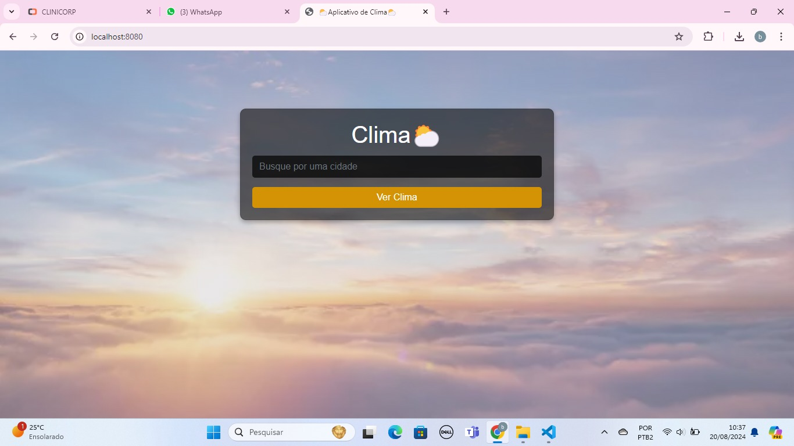
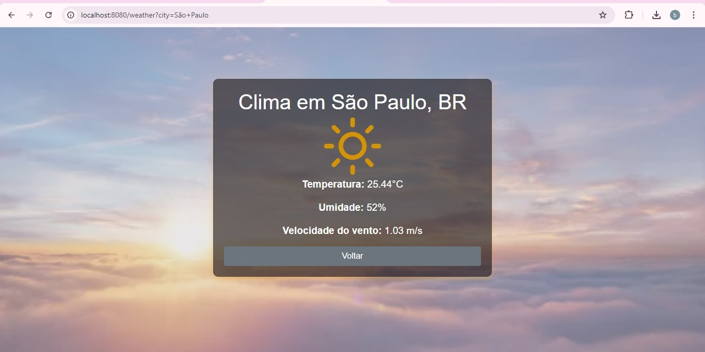

<h1 align="center">
  Aplicativo de Clima 🌤️
</h1>

O App de clima foi desenvovildo para que os usuários possam consultar como está o clima da sua cidade de forma simples e prática!

<h3> O app trás as seguintes informações meteorológicas: </h3>

* Temperatura
* Umidade
* Velocidade do vento

## :rocket: Tecnologias utilizadas

* Java
* Spring Boot
* Dev Tools
* Lombok
* Thymeleaf
* HttpClient
  

:mag: Baixe o projeto e teste você mesmo na prática.
